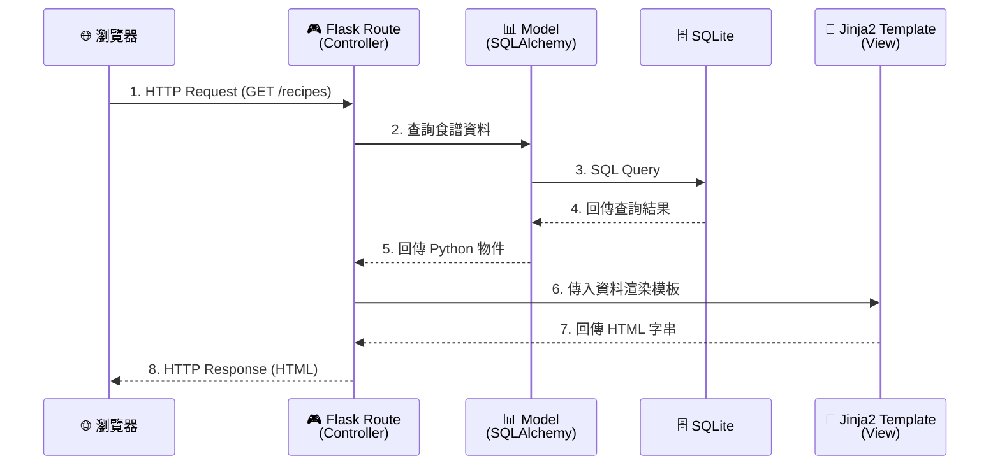
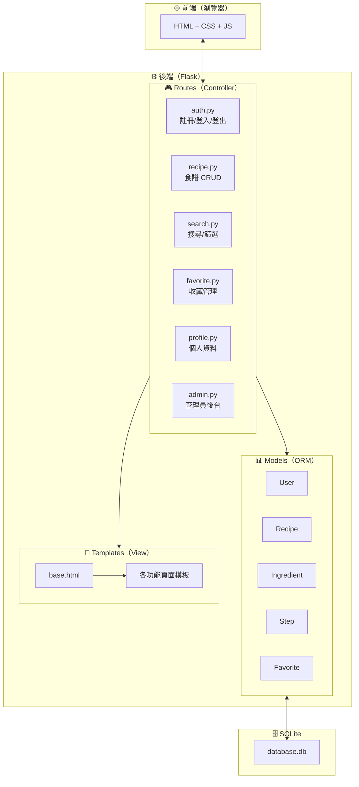
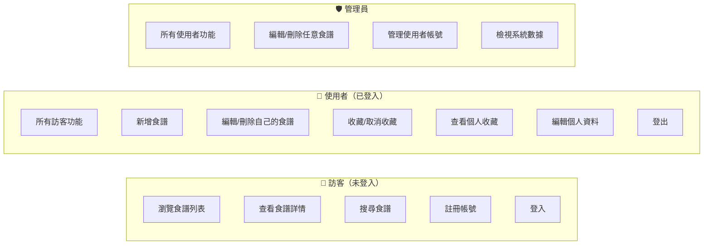

# 食譜收藏夾系統 — 系統架構文件

> 版本：1.0  
> 日期：2026-04-09  
> 依據：[PRD.md](./PRD.md)

---

## 1. 技術架構說明

### 1.1 選用技術與原因

| 技術 | 用途 | 選用原因 |
|------|------|----------|
| **Python 3** | 程式語言 | 語法簡潔易學，適合初學者與快速開發 |
| **Flask** | 後端 Web 框架 | 輕量級微框架，學習曲線低，彈性高 |
| **Jinja2** | 模板引擎 | Flask 內建整合，支援模板繼承與條件渲染 |
| **SQLite** | 資料庫 | 零設定、檔案型資料庫，開發階段免安裝 |
| **SQLAlchemy** | ORM 工具 | 簡化資料庫操作，避免手寫 SQL，防止 SQL Injection |
| **Flask-Login** | 登入管理 | 處理使用者登入狀態、Session 管理 |
| **Werkzeug** | 密碼雜湊 | Flask 內建，提供安全的密碼 hash / verify |
| **HTML + CSS + JS** | 前端 | 原生技術，無需額外打包工具 |

### 1.2 Flask MVC 模式說明

本專案採用 **MVC（Model-View-Controller）** 架構模式，將程式碼職責清楚分離：

```
┌─────────────────────────────────────────────────────────┐
│                        瀏覽器                            │
│                   （使用者操作介面）                       │
└──────────────┬──────────────────────┬────────────────────┘
               │ HTTP Request         │ HTTP Response (HTML)
               ▼                      │
┌──────────────────────────┐          │
│    Controller（控制器）    │          │
│    app/routes/*.py       │          │
│                          │          │
│  • 接收使用者請求          │          │
│  • 呼叫 Model 存取資料    │          │
│  • 選擇 View 回傳頁面     │          │
└──────┬───────────┬───────┘          │
       │           │                  │
       ▼           ▼                  │
┌────────────┐ ┌─────────────────┐    │
│   Model    │ │  View（視圖）    │    │
│  （模型）   │ │  templates/*.html│───┘
│            │ │                 │
│ app/       │ │ • Jinja2 模板   │
│ models/    │ │ • 呈現資料為     │
│ *.py       │ │   HTML 頁面     │
│            │ │ • 模板繼承      │
│ • 定義資料  │ │   減少重複      │
│   結構     │ └─────────────────┘
│ • 資料庫   │
│   CRUD 操作│
└──────┬─────┘
       │
       ▼
┌─────────────┐
│   SQLite    │
│ database.db │
└─────────────┘
```

| 層級 | 對應檔案 | 職責說明 |
|------|----------|----------|
| **Model（模型）** | `app/models/*.py` | 定義資料表結構（ORM），封裝資料庫的新增、查詢、修改、刪除操作 |
| **View（視圖）** | `app/templates/*.html` | Jinja2 模板，負責將資料渲染成 HTML 頁面呈現給使用者 |
| **Controller（控制器）** | `app/routes/*.py` | Flask 路由函式，接收 HTTP 請求、呼叫 Model 取得資料、選擇 View 回傳回應 |

---

## 2. 專案資料夾結構

```
recipe-collection/
│
├── app.py                      ← 🚀 應用程式入口，啟動 Flask server
├── config.py                   ← ⚙️ 設定檔（資料庫路徑、密鑰、上傳限制等）
├── requirements.txt            ← 📦 Python 套件相依清單
│
├── app/                        ← 📁 主要應用程式目錄
│   ├── __init__.py             ← Flask app 工廠函式（create_app）
│   │
│   ├── models/                 ← 📊 Model 層：資料庫模型
│   │   ├── __init__.py
│   │   ├── user.py             ← 使用者模型（User）
│   │   ├── recipe.py           ← 食譜模型（Recipe）
│   │   ├── ingredient.py       ← 食材模型（Ingredient）
│   │   ├── step.py             ← 步驟模型（Step）
│   │   └── favorite.py         ← 收藏模型（Favorite）
│   │
│   ├── routes/                 ← 🎮 Controller 層：Flask 路由
│   │   ├── __init__.py
│   │   ├── auth.py             ← 註冊、登入、登出
│   │   ├── recipe.py           ← 食譜 CRUD（新增/瀏覽/編輯/刪除）
│   │   ├── search.py           ← 搜尋與篩選
│   │   ├── favorite.py         ← 收藏 / 取消收藏
│   │   ├── profile.py          ← 個人資料
│   │   └── admin.py            ← 管理員後台
│   │
│   ├── templates/              ← 🎨 View 層：Jinja2 HTML 模板
│   │   ├── base.html           ← 基礎模板（共用 header / footer / navbar）
│   │   ├── index.html          ← 首頁（推薦食譜 + 搜尋入口）
│   │   │
│   │   ├── auth/               ← 認證相關頁面
│   │   │   ├── login.html      ← 登入頁
│   │   │   └── register.html   ← 註冊頁
│   │   │
│   │   ├── recipe/             ← 食譜相關頁面
│   │   │   ├── list.html       ← 食譜列表頁
│   │   │   ├── detail.html     ← 食譜詳情頁（食材 + 步驟）
│   │   │   ├── create.html     ← 新增食譜表單
│   │   │   └── edit.html       ← 編輯食譜表單
│   │   │
│   │   ├── favorite/           ← 收藏相關頁面
│   │   │   └── list.html       ← 個人收藏清單
│   │   │
│   │   ├── profile/            ← 個人資料頁面
│   │   │   └── index.html      ← 個人資料頁
│   │   │
│   │   └── admin/              ← 管理員後台頁面
│   │       ├── dashboard.html  ← 管理員儀表板
│   │       ├── recipes.html    ← 管理食譜清單
│   │       └── users.html      ← 管理使用者清單
│   │
│   └── static/                 ← 📂 靜態資源
│       ├── css/
│       │   └── style.css       ← 全站樣式表
│       ├── js/
│       │   └── main.js         ← 全站 JavaScript
│       └── uploads/            ← 使用者上傳的食譜圖片
│
├── instance/                   ← 🗄️ 實例資料（不納入版本控制）
│   └── database.db             ← SQLite 資料庫檔案
│
└── docs/                       ← 📝 專案文件
    ├── PRD.md                  ← 產品需求文件
    └── ARCHITECTURE.md         ← 系統架構文件（本文件）
```

### 各目錄說明

| 目錄/檔案 | 說明 |
|-----------|------|
| `app.py` | 應用程式進入點，執行 `python app.py` 啟動開發伺服器 |
| `config.py` | 集中管理設定（SECRET_KEY、資料庫 URI、上傳路徑等） |
| `app/__init__.py` | 使用 App Factory Pattern 建立 Flask 實例，註冊 Blueprint |
| `app/models/` | 每個資料表對應一個 Python 檔案，使用 SQLAlchemy ORM 定義 |
| `app/routes/` | 每個功能模組對應一個 Blueprint，負責處理 HTTP 請求 |
| `app/templates/` | 依功能分子目錄，所有模板繼承 `base.html` |
| `app/static/` | CSS、JS 與使用者上傳的圖片 |
| `instance/` | SQLite 資料庫檔案，此目錄應加入 `.gitignore` |

---

## 3. 元件關係圖

### 3.1 請求處理流程



### 3.2 系統功能模組圖



### 3.3 使用者角色與權限



---

## 4. 關鍵設計決策

### 決策 1：使用 App Factory Pattern

**做法：** 在 `app/__init__.py` 中使用 `create_app()` 工廠函式建立 Flask 實例。

**原因：**
- 方便切換不同設定（開發 / 測試 / 生產）
- 避免循環引用問題
- Flask 官方推薦做法

```python
# app/__init__.py 範例
def create_app():
    app = Flask(__name__)
    app.config.from_object('config.Config')

    db.init_app(app)
    login_manager.init_app(app)

    from app.routes import auth, recipe, search, favorite, profile, admin
    app.register_blueprint(auth.bp)
    app.register_blueprint(recipe.bp)
    app.register_blueprint(search.bp)
    app.register_blueprint(favorite.bp)
    app.register_blueprint(profile.bp)
    app.register_blueprint(admin.bp)

    return app
```

---

### 決策 2：使用 Blueprint 模組化路由

**做法：** 每個功能模組使用獨立的 Flask Blueprint。

**原因：**
- 程式碼依功能分離，易於維護
- 團隊成員可以各自負責不同模組，減少衝突
- 路由前綴清楚（如 `/auth/login`、`/recipes/new`）

```python
# app/routes/recipe.py 範例
from flask import Blueprint

bp = Blueprint('recipe', __name__, url_prefix='/recipes')

@bp.route('/')
def list_recipes():
    ...
```

---

### 決策 3：使用 SQLAlchemy ORM 而非手寫 SQL

**做法：** 透過 SQLAlchemy 定義資料表模型，以 Python 物件操作資料庫。

**原因：**
- 自動防止 SQL Injection 安全漏洞
- 程式碼可讀性高，降低學習門檻
- 支援資料表關聯（一對多、多對多），減少手動 JOIN

```python
# app/models/recipe.py 範例
class Recipe(db.Model):
    id = db.Column(db.Integer, primary_key=True)
    title = db.Column(db.String(100), nullable=False)
    description = db.Column(db.Text)
    difficulty = db.Column(db.String(10))  # 簡單/中等/困難
    cook_time = db.Column(db.Integer)      # 分鐘
    created_at = db.Column(db.DateTime, default=datetime.utcnow)

    # 關聯
    author_id = db.Column(db.Integer, db.ForeignKey('user.id'))
    ingredients = db.relationship('Ingredient', backref='recipe')
    steps = db.relationship('Step', backref='recipe', order_by='Step.order')
```

---

### 決策 4：模板繼承減少重複程式碼

**做法：** 所有頁面模板繼承 `base.html`，只覆寫各自的內容區塊。

**原因：**
- 導覽列、頁尾、CSS/JS 引入只需寫一次
- 統一頁面風格與佈局
- 修改共用元素時只需改一個檔案

```html
<!-- templates/base.html -->
<!DOCTYPE html>
<html lang="zh-Hant">
<head>
    <meta charset="UTF-8">
    <title>食譜收藏夾</title>
    <link rel="stylesheet" href="{{ url_for('static', filename='css/style.css') }}">
</head>
<body>
    <nav><!-- 共用導覽列 --></nav>
    <main></main>
    <footer><!-- 共用頁尾 --></footer>
</body>
</html>
```

```html
<!-- templates/recipe/list.html -->

食譜列表

    <h1>所有食譜</h1>
    <!-- 食譜卡片 -->

```

---

### 決策 5：食材與步驟獨立為子表

**做法：** 食材（Ingredient）與步驟（Step）各自獨立為資料表，透過外鍵關聯至食譜（Recipe）。

**原因：**
- 一道食譜可有多個食材與多個步驟（一對多關係）
- 方便個別新增、修改、刪除單一食材或步驟
- 支援未來的「合併購物清單」功能（可跨食譜查詢食材）
- 步驟可透過 `order` 欄位維護順序

```
Recipe (1) ──── (N) Ingredient
   │                  ├── name（食材名稱）
   │                  ├── quantity（數量）
   │                  └── unit（單位）
   │
   └────── (N) Step
                  ├── order（步驟編號）
                  └── description（步驟說明）
```

---

## 5. 安全機制

| 安全議題 | 解決方案 |
|----------|----------|
| 密碼安全 | 使用 `werkzeug.security` 的 `generate_password_hash` / `check_password_hash` 進行雜湊 |
| SQL Injection | 使用 SQLAlchemy ORM 參數化查詢，避免手動拼接 SQL |
| XSS 攻擊 | Jinja2 預設啟用自動轉義（auto-escape），所有輸出自動 HTML Escape |
| CSRF 攻擊 | Flask-WTF 提供 CSRF Token 保護表單 |
| 權限控制 | Flask-Login 的 `@login_required` 裝飾器 + 自訂 `@admin_required` 裝飾器 |
| 檔案上傳 | 限制副檔名（僅允許圖片格式）、限制檔案大小（≤ 5MB） |

---

## 6. 開發環境建置

### 快速啟動步驟

```bash
# 1. 建立虛擬環境
python3 -m venv venv
source venv/bin/activate        # macOS / Linux

# 2. 安裝套件
pip install -r requirements.txt

# 3. 初始化資料庫
flask db init
flask db migrate
flask db upgrade

# 4. 啟動開發伺服器
python app.py
# 或
flask run --debug
```

### requirements.txt（預估）

```
Flask==3.0.*
Flask-SQLAlchemy==3.1.*
Flask-Login==0.6.*
Flask-WTF==1.2.*
```
