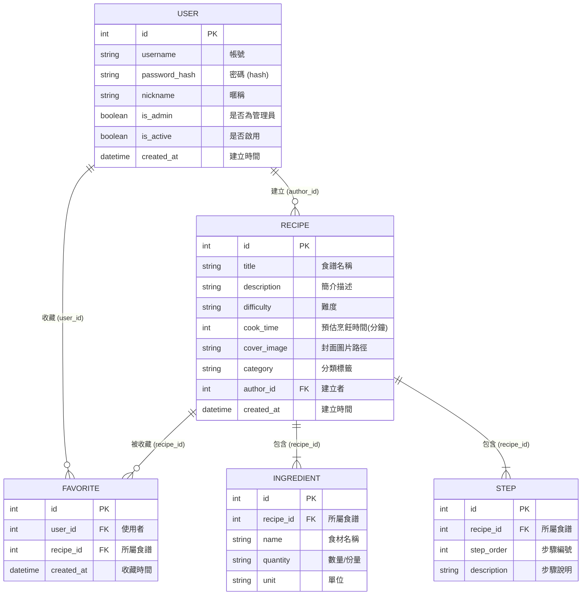

# 資料庫設計文件 (DB Design)

本資料庫設計基於 `docs/PRD.md` 與 `docs/ARCHITECTURE.md` 的需求所建立。

## 1. ER 圖（實體關係圖）

## 2. 資料表詳細說明

### 2.1 USER (使用者表)
儲存使用者帳號資訊。

| 欄位名稱 | 型別 | 必填 | 說明 |
| --- | --- | --- | --- |
| `id` | INTEGER | Y | Primary Key, 自動遞增 |
| `username` | VARCHAR(50) | Y | 使用者帳號，唯一值，用於登入 |
| `password_hash` | VARCHAR(255) | Y | 加密後的密碼 |
| `nickname` | VARCHAR(50) | Y | 顯示暱稱 |
| `is_admin` | BOOLEAN | Y | 是否為管理員，預設 False |
| `is_active` | BOOLEAN | Y | 帳號是否啟用（可用於停用帳號），預設 True |
| `created_at` | DATETIME | Y | 帳號建立時間，預設 CURRENT_TIMESTAMP |

### 2.2 RECIPE (食譜表)
儲存食譜的基本資訊。

| 欄位名稱 | 型別 | 必填 | 說明 |
| --- | --- | --- | --- |
| `id` | INTEGER | Y | Primary Key, 自動遞增 |
| `title` | VARCHAR(100) | Y | 食譜名稱 |
| `description` | TEXT | N | 簡介描述 |
| `difficulty` | VARCHAR(10) | N | 難度 (例如：簡單 / 中等 / 困難) |
| `cook_time` | INTEGER | N | 預估烹飪時間 (以分鐘為單位) |
| `cover_image` | VARCHAR(255)| N | 封面圖片檔案路徑 |
| `category` | VARCHAR(50) | N | 分類標籤 (例如：中式, 甜點) |
| `author_id` | INTEGER | Y | Foreign Key, 關聯至 \`USER.id\`，建立此食譜的使用者 |
| `created_at` | DATETIME | Y | 食譜建立時間，預設 CURRENT_TIMESTAMP |

### 2.3 INGREDIENT (食材表)
儲存每道食譜所需的食材清單。

| 欄位名稱 | 型別 | 必填 | 說明 |
| --- | --- | --- | --- |
| `id` | INTEGER | Y | Primary Key, 自動遞增 |
| `recipe_id` | INTEGER | Y | Foreign Key, 關聯至 \`RECIPE.id\`，若食譜刪除則級聯刪除(CASCADE) |
| `name` | VARCHAR(100) | Y | 食材名稱 |
| `quantity` | VARCHAR(50) | Y | 份量 (使用字串以容納 "適量" 或分數如 "1/2") |
| `unit` | VARCHAR(20) | N | 單位 (例如：克, 匙, 毫升) |

### 2.4 STEP (步驟表)
儲存每道食譜的烹飪步驟。

| 欄位名稱 | 型別 | 必填 | 說明 |
| --- | --- | --- | --- |
| `id` | INTEGER | Y | Primary Key, 自動遞增 |
| `recipe_id` | INTEGER | Y | Foreign Key, 關聯至 \`RECIPE.id\`，若食譜刪除則級聯刪除(CASCADE) |
| `step_order` | INTEGER | Y | 步驟編號 (用以排序步驟 1, 2, 3...) |
| `description` | TEXT | Y | 步驟說明文字 |

### 2.5 FAVORITE (收藏表)
儲存使用者的食譜收藏紀錄 (多對多關聯中介表)。

| 欄位名稱 | 型別 | 必填 | 說明 |
| --- | --- | --- | --- |
| `id` | INTEGER | Y | Primary Key, 自動遞增 |
| `user_id` | INTEGER | Y | Foreign Key, 關聯至 \`USER.id\`，若使用者刪除則級聯刪除 |
| `recipe_id` | INTEGER | Y | Foreign Key, 關聯至 \`RECIPE.id\`，若食譜刪除則級聯刪除 |
| `created_at` | DATETIME | Y | 加入收藏的時間，預設 CURRENT_TIMESTAMP |

## 3. SQL 建表語法
請參考 `database/schema.sql`，提供完整的 CREATE TABLE 語法。

## 4. Python Model 程式碼
基於 SQLAlchemy，Model 程式碼位於 `app/models/` 目錄內：
- `user.py`: `User` 模型
- `recipe.py`: `Recipe` 模型
- `ingredient.py`: `Ingredient` 模型
- `step.py`: `Step` 模型
- `favorite.py`: `Favorite` 模型
- `__init__.py`: 載入所有模型的入口點
