# 食譜收藏夾系統 — 流程圖文件

> 版本：1.0  
> 日期：2026-04-09  
> 依據：[PRD.md](./PRD.md)、[ARCHITECTURE.md](./ARCHITECTURE.md)

---

## 1. 使用者流程圖（User Flow）

### 1.1 整體操作流程

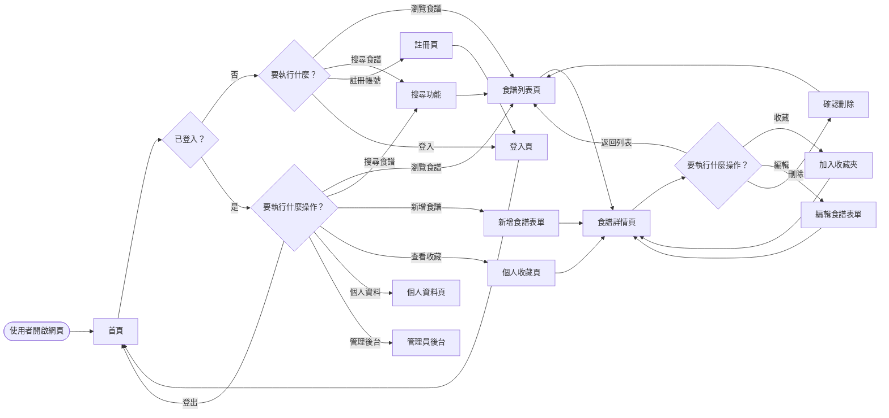

### 1.2 註冊與登入流程

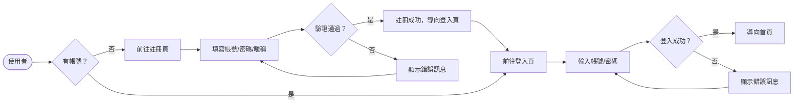

### 1.3 新增食譜流程

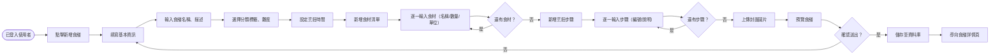

### 1.4 搜尋食譜流程

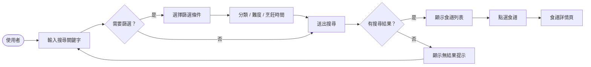

### 1.5 收藏食譜流程

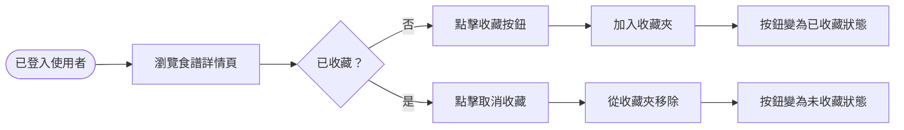

### 1.6 管理員操作流程

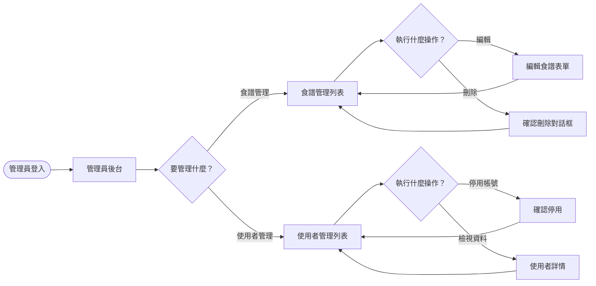

---

## 2. 系統序列圖（Sequence Diagram）

### 2.1 使用者註冊

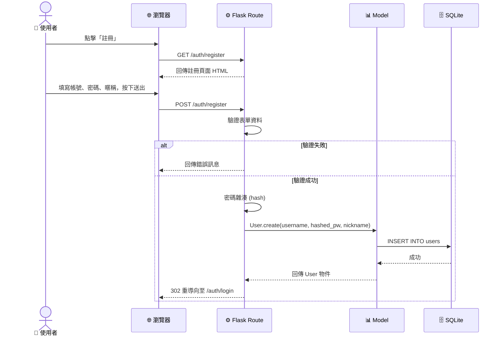

### 2.2 使用者登入

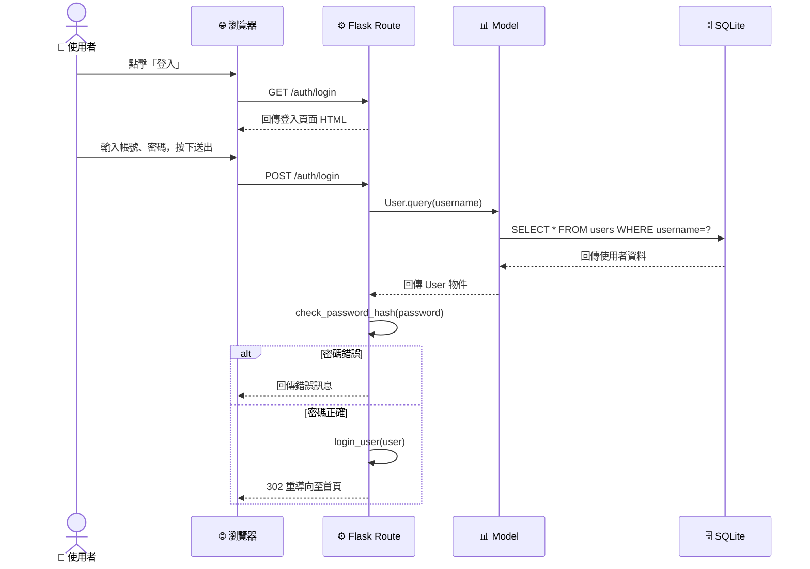

### 2.3 新增食譜

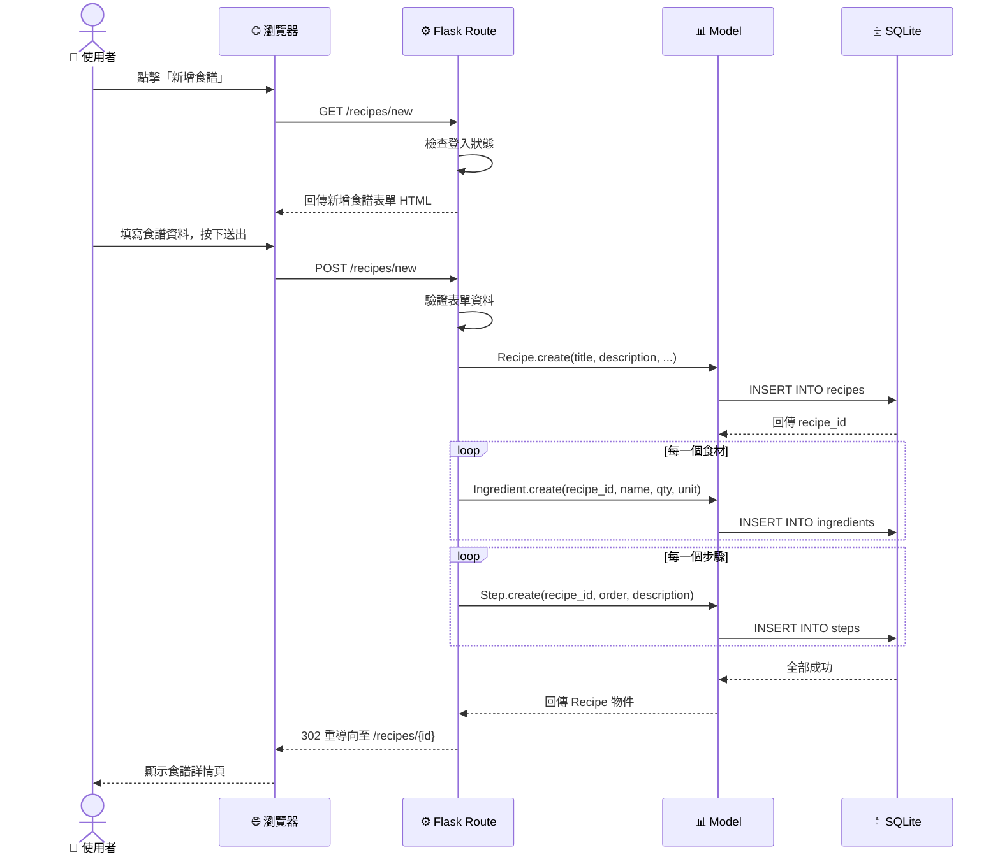

### 2.4 搜尋食譜

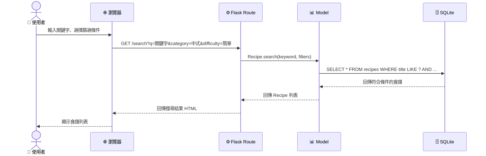

### 2.5 收藏 / 取消收藏

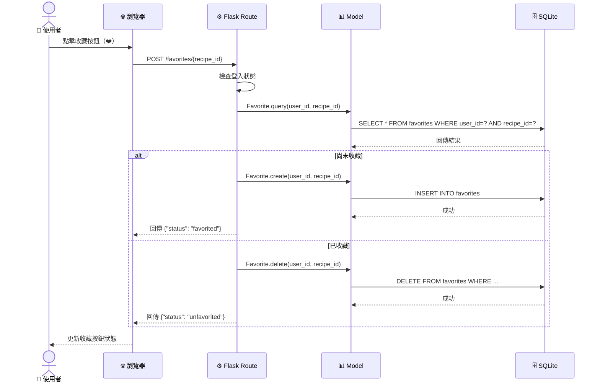

### 2.6 管理員刪除食譜

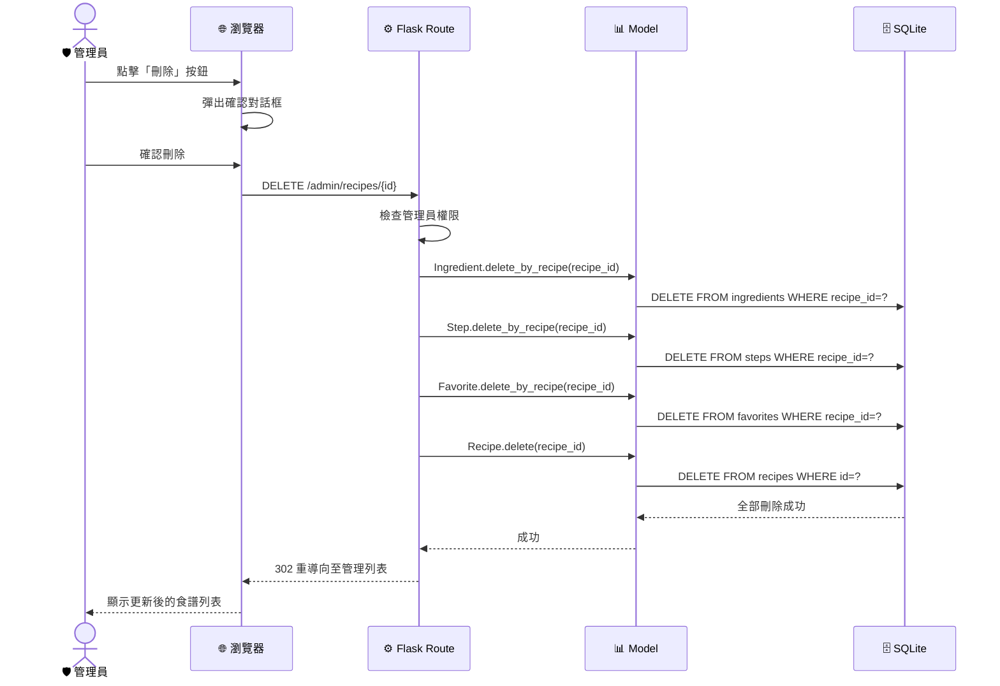

---

## 3. 功能清單對照表

| # | 功能 | URL 路徑 | HTTP 方法 | 說明 |
|---|------|----------|-----------|------|
| 1 | 首頁 | `/` | GET | 顯示推薦食譜、最新食譜、搜尋入口 |
| 2 | 使用者註冊 | `/auth/register` | GET / POST | 顯示註冊表單 / 處理註冊 |
| 3 | 使用者登入 | `/auth/login` | GET / POST | 顯示登入表單 / 處理登入 |
| 4 | 使用者登出 | `/auth/logout` | GET | 登出並清除 Session |
| 5 | 食譜列表 | `/recipes` | GET | 顯示所有食譜列表 |
| 6 | 食譜詳情 | `/recipes/<id>` | GET | 顯示食譜完整資訊（食材 + 步驟） |
| 7 | 新增食譜 | `/recipes/new` | GET / POST | 顯示新增表單 / 處理新增 |
| 8 | 編輯食譜 | `/recipes/<id>/edit` | GET / POST | 顯示編輯表單 / 處理編輯 |
| 9 | 刪除食譜 | `/recipes/<id>/delete` | POST | 刪除指定食譜 |
| 10 | 搜尋食譜 | `/search` | GET | 依關鍵字與篩選條件搜尋 |
| 11 | 收藏食譜 | `/favorites/<recipe_id>` | POST | 收藏 / 取消收藏（toggle） |
| 12 | 收藏清單 | `/favorites` | GET | 顯示個人收藏的食譜清單 |
| 13 | 個人資料 | `/profile` | GET / POST | 顯示 / 編輯個人資料 |
| 14 | 管理員儀表板 | `/admin` | GET | 管理員後台首頁 |
| 15 | 管理食譜 | `/admin/recipes` | GET | 管理所有食譜清單 |
| 16 | 管理員刪除食譜 | `/admin/recipes/<id>/delete` | POST | 管理員刪除任意食譜 |
| 17 | 管理使用者 | `/admin/users` | GET | 管理所有使用者清單 |
| 18 | 停用使用者 | `/admin/users/<id>/toggle` | POST | 停用 / 啟用使用者帳號 |
